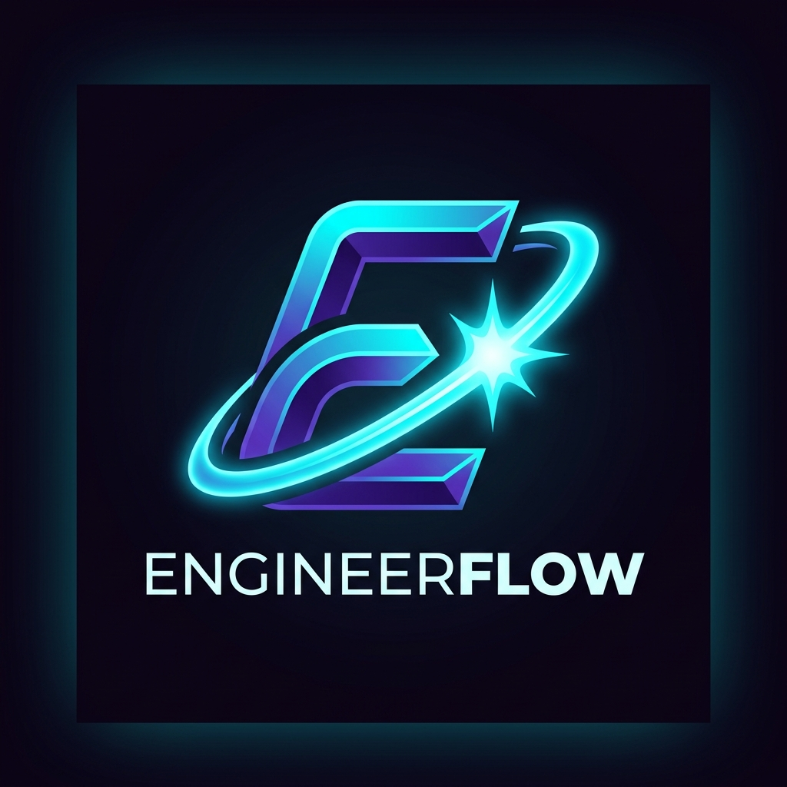
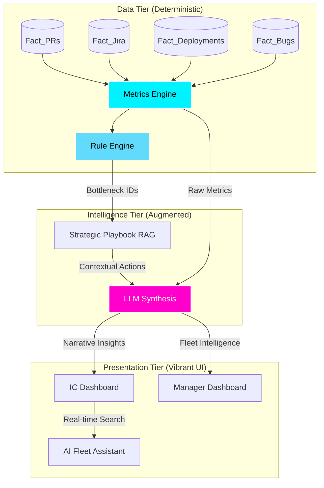

# ✦ EngineerFlow | Enterprise Productivity Intelligence

<div align="center">
  
  <h1>EngineerFlow</h1>
  <p><b>Predictive Engineering Intelligence for High-Performance Teams</b></p>
  
  <p align="center">
    
    
    
    
  </p>

  <p>
    <a href="#-architecture">Architecture</a> •
    <a href="#-the-brain">The Brain</a> •
    <a href="#-metrics-engine">Metrics Engine</a> •
    <a href="#-data-transparency">Data Model</a> •
    <a href="#-installation">Setup</a>
  </p>
</div>

---

## 📖 Overview

Traditional engineering dashboards are "Noise Engines"—they provide raw charts that require manual interpretation, leading to subjective bias and "metric fatigue."

**EngineerFlow** is an **Intelligence Engine**. It doesn't just show data; it **interprets** it. By anchoring high-performance LLMs to a strictly deterministic metrics core, it provides natural language insights that feel like they're coming from a Senior Engineering Leader.

### The Problem
*   **Metric Fatigue**: Too many charts, no clear "So What?"
*   **Calculation Bias**: AI-generated metrics often hallucinate math.
*   **Disconnected Data**: PR data vs. Jira data vs. Deployment data.

### The Solution
*   **Deterministic Accuracy**: Math is handled by pure logic, not LLMs.
*   **Contextual Narrative**: LLMs provide the "Human Context" around the numbers.
*   **Strategic Playbooks**: Mapping bottlenecks to actionable interventions.

---

## 🏗 Architecture

EngineerFlow follows a **Decoupled Intelligence Pipeline** architecture. This ensures that the "Source of Truth" is always deterministic while the "Interface Layer" remains conversational.



---

## 🧠 The Brain: Groq + Llama 3.3

At the heart of EngineerFlow is a specialized implementation of **Llama 3.3 (70B)** optimized for engineering management. 

### Why Groq?
We utilize Groq's LPU architecture to achieve **ultra-low latency inference** (~300 tokens/sec). This enables the "Fleet Assistant" to analyze massive team-wide metric sets and provide answers in real-time, making the AI feel integrated rather than "bolted on."

### System Prompt Engineering
The LLM is strictly constrained by two primary "guardrails":
1.  **Math Sovereignty**: The LLM is forbidden from calculating its own metrics. It MUST use the data provided by the deterministic engine.
2.  **Persona-Based Insights**: 
    *   **IC Persona**: Focuses on "Flow," "Deep Work," and "Process Friction."
    *   **Manager Persona**: Focuses on "Strategic Risk," "Team Burnout," and "Resource Allocation."

---

## 📊 Metrics Engine: The Mathematical Core

We adhere to the **DORA** and **SPACE** frameworks with a strict mathematical implementation in `logic/metrics.js`.

### KPI Deep Dive
| KPI | Formula | Why it matters |
| :--- | :--- | :--- |
| **Lead Time** | $\Delta(PR\_Opened \to Prod\_Deploy)$ | Measures the efficiency of the entire value stream. |
| **Cycle Time** | $\Delta(In\_Progress \to Done)$ | Measures the "coding speed" and internal process efficiency. |
| **Quality Index** | $1 - (\frac{Escaped\_Bugs}{Merged\_PRs})$ | Balances speed with stability. A low index triggers "Quality Safeguards." |
| **Release Agility** | $\frac{Successful\_Deploys}{Month}$ | Reflects the organization's ability to ship value frequently. |

---

## 📂 Data Transparency

EngineerFlow treats data as a **first-class citizen**. We provide a "Data Source" portal that maps raw Fact tables directly to the dashboard insights, ensuring full transparency.

### Core Data Models
*   `Dim_Developers`: Metadata (Skill level, Role, Team).
*   `Fact_Pull_Requests`: The pulse of code contribution.
*   `Fact_Jira_Issues`: The tracking of developer intent and effort.
*   `Fact_CI_Deployments`: The validation of shipped value.
*   `Fact_Bug_Reports`: The accountability for quality.

---

## 🎨 UI/UX: Premium Engineering Aesthetics

The interface is built with a **"Futuristic Professional"** design system.

*   **Glassmorphic Engine**: Utilizing backdrop-filters and semi-transparent layers for a deep, dimensional look.
*   **Micro-Animations**: Framer Motion powered transitions that provide immediate feedback (e.g., the pulsing "Stability Radar").
*   **Dual View Toggle**: Seamlessly switch between **Individual Insight** and **Team-wide Fleet Management**.
*   **Skeletal Loading**: Shimmering states ensure a perceived performance boost while data is being aggregated.

---

## ⚡ Installation & Deployment

### Environment Setup
Create a `.env` file in the `/backend` directory:
```env
XAI_API_KEY=your_groq_api_key
PORT=5001
NODE_ENV=production
```

### Local Development
```bash
# Clone
git clone https://github.com/Debojyoti-Gho/EngineerFlow.git

# Install All
npm install # Root
cd frontend && npm install
cd ../backend && npm install

# Run (Parallel)
npm start # Using concurrently
```

---

## 🗺 Roadmap
- [ ] **GitHub Webhook Integration**: Real-time data streaming.
- [ ] **Predictive Burnout Detection**: AI-driven sentiment analysis on PR comments.
- [ ] **Enterprise SSO**: SAML/OAuth integration for large-scale orgs.
- [ ] **Mobile-First Companion App**: Critical alerts for on-the-go managers.

---

<div align="center">
  <h3>Join the Flow</h3>
  <p>EngineerFlow is more than a dashboard. It's a culture shift toward transparent, high-integrity engineering management.</p>
  <b>Designed for the top 1% of Engineering Orgs.</b>
</div>
